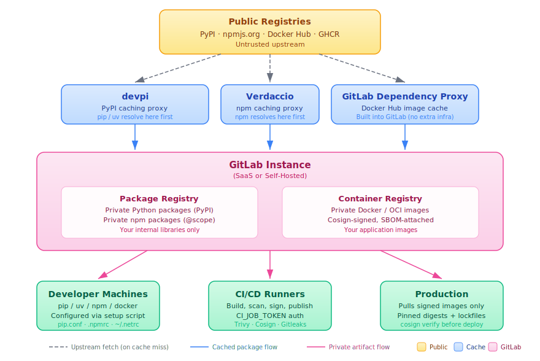

# GitLab as a Package & Container Registry: A Procedural Guide


This guide explains how to use GitLab (both SaaS and self-hosted CE/EE) to build a cost-effective, easy-to-implement, and scalable artifact management solution.

Initial scope includes Python (PyPI), Node.js (npm),and Docker/OCI images, with methods that can be extended to support additional formats (see [GitLab Packages & Registries](https://docs.gitlab.com/user/packages)).


Prerequisites:
- GitLab 16.0+
- Docker Engine 24+
- Git 2.40+ 


---

## Table of Contents

1. [Why You Need an Intermediate Package & Image Manager](#1-why-you-need-an-intermediate-package--image-manager)
2. [Architecture Overview](#2-architecture-overview)
3. [GitLab Package Registry Setup](#3-gitlab-package-registry-setup)
   - 3.1 [PyPI (Python)](#31-pypi-python)
   - 3.2 [npm (Node.js)](#32-npm-nodejs)
4. [GitLab Container Registry Setup](#4-gitlab-container-registry-setup)
5. [Managing Public/External Packages with Caching Proxies](#5-managing-publicexternal-packages-with-caching-proxies)
   - 5.1 [devpi for PyPI Caching](#51-devpi-for-pypi-caching)
   - 5.2 [Verdaccio for npm Caching](#52-verdaccio-for-npm-caching)
   - 5.3 [GitLab Dependency Proxy for Docker Images](#53-gitlab-dependency-proxy-for-docker-images)
   - 5.4 [Mirroring Non-Docker Hub Images](#54-mirroring-non-docker-hub-images)
6. [Managing Private Packages](#6-managing-private-packages)
7. [Managing Docker Images (Private & Public)](#7-managing-docker-images-private--public)
8. [Client Machine Configuration](#8-client-machine-configuration)
9. [CI/CD Automation](#9-cicd-automation)
10. [Security Scanning & Supply Chain Hardening](#10-security-scanning--supply-chain-hardening)
11. [Incident Response Plan](#11-incident-response-plan)
12. [Best Practices](#12-best-practices)

---

## 1. Why You Need an Intermediate Package & Image Manager

Modern software depends on thousands of external packages. Every `pip install`, `npm install`, or `docker pull` is a trust decision. Without an intermediate registry, your builds depend directly on public infrastructure you do not control.

### Supply Chain Attack Vectors

| Attack | Description | Real-World Example |
|---|---|---|
| **Typosquatting** | Malicious package with a name similar to a popular one | [`crossenv`](https://blog.npmjs.org/post/163723642530/crossenv-malware-on-the-npm-registry) mimicking `cross-env` on npm |
| **Dependency Confusion** | Attacker publishes a higher-versioned package to a public registry that shadows an internal package | [Alex Birsan's research](https://medium.com/@alex.birsan/dependency-confusion-4a5d60fec610) affecting Apple, Microsoft, PayPal |
| **Account Takeover** | Maintainer's credentials are compromised; attacker pushes a backdoored update | [`ua-parser-js`](https://github.com/nicehash/ua-parser-js/security/advisories) (npm, 2021) |
| **Build Pipeline Compromise** | Malicious code injected during the CI/CD build phase | [SolarWinds Orion](https://www.cisa.gov/solarwinds) (2020), [Codecov](https://about.codecov.io/security-update/) (2021) |
| **Malicious Upstream Maintainer** | A trusted maintainer intentionally inserts malicious code | [`colors` and `faker`](https://snyk.io/blog/open-source-npm-packages-colors-702faker/) (npm, 2022) |

### What an Intermediate Registry Gives You

- **Availability**: builds succeed even when upstream registries are down.
- **Speed**: cached packages are served locally, reducing network latency.
- **Auditability**: every package consumed is logged and traceable.
- **Control**: you decide which versions enter your environment.
- **Isolation**: internal packages are never exposed to public registries, preventing dependency confusion.

---

## 2. Architecture Overview




**Key design decisions:**

- **GitLab Package Registry** hosts **private** packages (your internal libraries).
- **Caching proxies** (devpi, Verdaccio) sit in front of **public** upstream registries and transparently cache on first request.
- **GitLab Dependency Proxy** caches **Docker Hub** images (available in GitLab 16.0+).
- **GitLab Container Registry** hosts **your own** Docker images.
- Developer machines and CI runners point to the caching proxy as their primary index, with GitLab as a secondary source for private packages.

> **Self-hosted vs. SaaS note**: On self-hosted GitLab, all components run on your infrastructure. On GitLab.com, the Package Registry and Container Registry are managed for you. Caching proxies (devpi, Verdaccio) always run on your infrastructure regardless of GitLab deployment model.

---

## 3. GitLab Package Registry Setup

GitLab's [Package Registry](https://docs.gitlab.com/ee/user/packages/package_registry/) supports PyPI, npm, Maven, NuGet, Go, Composer, Conan, Helm, and generic packages. It is available on GitLab Free tier for both SaaS and self-hosted solutions.

### 3.1 PyPI (Python)

**Reference**: [GitLab PyPI Repository Docs](https://docs.gitlab.com/ee/user/packages/pypi_repository/)

#### Enable the Package Registry (self-hosted only)

The Package Registry is enabled by default on GitLab.com. For self-hosted instances, verify it is enabled:

```ruby
# /etc/gitlab/gitlab.rb
gitlab_rails['packages_enabled'] = true
```

```bash
sudo gitlab-ctl reconfigure
```

#### Create an Access Token

Generate a [project access token](https://docs.gitlab.com/ee/user/project/settings/project_access_tokens.html) or [personal access token](https://docs.gitlab.com/ee/user/profile/personal_access_tokens.html) with the `api` scope.

For CI/CD pipelines, use the built-in `CI_JOB_TOKEN` (no manual token creation required).

#### Publish a Python Package

```bash
# Build the package
python -m build

# Upload to GitLab
twine upload \
  --repository-url https://gitlab.example.com/api/v4/projects/<PROJECT_ID>/packages/pypi \
  -u <token-name> \
  -p <token-value> \
  dist/*
```

Or configure `~/.pypirc`:

```ini
# ~/.pypirc
[distutils]
index-servers = gitlab

[gitlab]
repository = https://gitlab.example.com/api/v4/projects/<PROJECT_ID>/packages/pypi
username = <token-name>
password = <token-value>
```

Then: `twine upload --repository gitlab dist/*`

#### Install from GitLab

```bash
pip install <package-name> \
  --index-url https://<token-name>:<token-value>@gitlab.example.com/api/v4/projects/<PROJECT_ID>/packages/pypi/simple
```

### 3.2 npm (Node.js)

**Reference**: [GitLab npm Registry Docs](https://docs.gitlab.com/ee/user/packages/npm_registry/)

#### Scoped Package Setup

GitLab npm packages **must** use a scope that matches your GitLab top-level group. For example, if your group is `my-org`, your packages must be scoped as `@my-org/package-name`.

Update `package.json`:

```json
{
  "name": "@my-org/my-library",
  "version": "1.0.0",
  "publishConfig": {
    "@my-org:registry": "https://gitlab.example.com/api/v4/projects/<PROJECT_ID>/packages/npm/"
  }
}
```

#### Authenticate

```bash
# Project-level .npmrc
echo "@my-org:registry=https://gitlab.example.com/api/v4/projects/<PROJECT_ID>/packages/npm/" >> .npmrc
echo "//gitlab.example.com/api/v4/projects/<PROJECT_ID>/packages/npm/:_authToken=<token>" >> .npmrc
```

#### Publish and Install

```bash
# Publish
npm publish

# Install
npm install @my-org/my-library
```

---

## 4. GitLab Container Registry Setup

**Reference**: [GitLab Container Registry Docs](https://docs.gitlab.com/ee/user/packages/container_registry/)

The Container Registry is enabled by default on GitLab.com. For self-hosted GitLab, enable it:

```ruby
# /etc/gitlab/gitlab.rb
registry_external_url 'https://registry.gitlab.example.com'
```

```bash
sudo gitlab-ctl reconfigure
```

#### Authenticate Docker

```bash
# Interactive login
docker login registry.gitlab.example.com

# Token-based (CI/CD)
echo "$CI_JOB_TOKEN" | docker login registry.gitlab.example.com -u gitlab-ci-token --password-stdin
```

#### Build, Tag, Push

```bash
# Tag format: <registry>/<namespace>/<project>/<image>:<tag>
docker build -t registry.gitlab.example.com/my-org/my-app:1.0.0 .
docker push registry.gitlab.example.com/my-org/my-app:1.0.0
```

#### Cleanup Policies

Configure [cleanup policies](https://docs.gitlab.com/ee/user/packages/container_registry/reduce_container_registry_storage.html) to automatically remove old tags:

Navigate to **Settings > Packages and registries > Container Registry > Cleanup policies** or set via API:

```bash
curl --request PUT \
  --header "PRIVATE-TOKEN: <token>" \
  --header "Content-Type: application/json" \
  --data '{
    "container_expiration_policy_attributes": {
      "cadence": "7d",
      "enabled": true,
      "keep_n": 5,
      "older_than": "30d",
      "name_regex": ".*",
      "name_regex_keep": "latest|stable|release-.*"
    }
  }' \
  "https://gitlab.example.com/api/v4/projects/<PROJECT_ID>"
```

---

## 5. Managing Public/External Packages with Caching Proxies

GitLab's Package Registry is a **storage registry**, not a **caching proxy**. It does not automatically mirror upstream PyPI or npm. To get transparent caching of public packages (similar to JFrog/Nexus "remote repository" behavior), deploy a caching proxy alongside GitLab.

### 5.1 devpi for PyPI Caching

[devpi](https://devpi.net/docs/devpi/devpi/stable/) is the recommended caching proxy for PyPI. It transparently fetches from upstream on the first request, caches locally, and serves from cache on subsequent requests.

**Reference**: [devpi Documentation](https://devpi.net/docs/devpi/devpi/stable/%2Bd/index.html)

#### Deploy devpi

Using Docker (see [`cicd/docker-compose.devpi.yml`](cicd/docker-compose.devpi.yml)):

```bash
docker run -d \
  --name devpi \
  --restart unless-stopped \
  -p 3141:3141 \
  -v devpi-data:/data \
  devpi/devpi-server:latest \
  devpi-server --host 0.0.0.0 --port 3141
```

#### Create a Private Index (Optional)

devpi supports overlay indices (i.e., a private index that falls through to the cached upstream):

```bash
# Install the devpi client
pip install devpi-client

# Connect and create a user/index
devpi use http://devpi.internal:3141
devpi user -c myorg password=<password>
devpi login myorg --password=<password>

# Create an index that inherits from root/pypi (the upstream cache)
devpi index -c myorg/stable bases=root/pypi volatile=False
```

#### Point pip/uv at devpi

```bash
# pip
pip install flask --index-url http://devpi.internal:3141/root/pypi/+simple/

# uv
uv pip install flask --index-url http://devpi.internal:3141/root/pypi/+simple/
```

Or configure globally (see [Section 8](#8-client-machine-configuration)).

#### How Caching Works

1. Developer runs `pip install flask`.
2. pip queries devpi at `devpi.internal:3141`.
3. devpi checks its local cache.
4. **Cache miss**: devpi fetches from `https://pypi.org`, stores the package, and serves it.
5. **Cache hit**: devpi serves directly from local storage.

No scheduled sync pipelines needed. The cache is populated on demand.

### 5.2 Verdaccio for npm Caching

[Verdaccio](https://verdaccio.org/) is a lightweight proxy/cache registry for npm.

**Reference**: [Verdaccio Documentation](https://verdaccio.org/docs/what-is-verdaccio)

#### Deploy Verdaccio

```bash
docker run -d \
  --name verdaccio \
  --restart unless-stopped \
  -p 4873:4873 \
  -v verdaccio-data:/verdaccio/storage \
  -v ./config/verdaccio/config.yaml:/verdaccio/conf/config.yaml \
  verdaccio/verdaccio:5
```

See [`config/verdaccio/config.yaml`](config/verdaccio/config.yaml) for the recommended configuration.

#### Point npm at Verdaccio

```bash
npm set registry http://verdaccio.internal:4873/
```

### 5.3 GitLab Dependency Proxy for Docker Images

GitLab includes a built-in [Dependency Proxy](https://docs.gitlab.com/ee/user/packages/dependency_proxy/) that acts as a **pull-through cache** for Docker Hub images. On first pull, it fetches from Docker Hub and caches the image in GitLab. Subsequent pulls serve from cache automatically. No sync pipelines or manual intervention is required.

**Reference**: [GitLab Dependency Proxy docs](https://docs.gitlab.com/ee/user/packages/dependency_proxy/)

> **Scope**: The Dependency Proxy works with **Docker Hub images only**. Images hosted on other registries (GHCR, Quay, ECR Public) require the mirror pipeline described in [Section 5.4](#54-mirroring-non-docker-hub-images).

#### Enable (self-hosted only)

```ruby
# /etc/gitlab/gitlab.rb
gitlab_rails['dependency_proxy_enabled'] = true
```

```bash
sudo gitlab-ctl reconfigure
```

#### Pull Through the Proxy

Any image available on Docker Hub can be cached. The URL pattern is:

```
gitlab.example.com/<group>/dependency_proxy/containers/<image>:<tag>
```

**Examples of Docker Hub Images that Work with the Dependency Proxy:**

```bash
# Language runtimes
docker pull gitlab.example.com/my-org/dependency_proxy/containers/python:3.12-slim
docker pull gitlab.example.com/my-org/dependency_proxy/containers/node:20-slim
docker pull gitlab.example.com/my-org/dependency_proxy/containers/golang:1.22-alpine

# Databases
docker pull gitlab.example.com/my-org/dependency_proxy/containers/postgres:16-alpine
docker pull gitlab.example.com/my-org/dependency_proxy/containers/redis:7-alpine
docker pull gitlab.example.com/my-org/dependency_proxy/containers/neo4j:5.26-enterprise
docker pull gitlab.example.com/my-org/dependency_proxy/containers/mongo:7

# Infrastructure
docker pull gitlab.example.com/my-org/dependency_proxy/containers/nginx:1.25-alpine
docker pull gitlab.example.com/my-org/dependency_proxy/containers/traefik:v3.0
docker pull gitlab.example.com/my-org/dependency_proxy/containers/vault:1.15

# CI/CD tooling
docker pull gitlab.example.com/my-org/dependency_proxy/containers/docker:24-dind
docker pull gitlab.example.com/my-org/dependency_proxy/containers/alpine:3.19

```

In a `Dockerfile`:

```dockerfile
# These all resolve through the Dependency Proxy cache
FROM gitlab.example.com/my-org/dependency_proxy/containers/python:3.12-slim
FROM gitlab.example.com/my-org/dependency_proxy/containers/neo4j:5.26-enterprise
FROM gitlab.example.com/my-org/dependency_proxy/containers/nginx:1.25-alpine
```

In CI/CD (`.gitlab-ci.yml`):

```yaml
variables:
  # CI_DEPENDENCY_PROXY_GROUP_IMAGE_PREFIX is a built-in GitLab variable
  # that resolves to: gitlab.example.com/<group>/dependency_proxy/containers
  PYTHON_IMAGE: "${CI_DEPENDENCY_PROXY_GROUP_IMAGE_PREFIX}/python:3.12-slim"
  NEO4J_IMAGE: "${CI_DEPENDENCY_PROXY_GROUP_IMAGE_PREFIX}/neo4j:5.26-enterprise"

build:
  image: $PYTHON_IMAGE
  services:
    - name: $NEO4J_IMAGE
      alias: neo4j
  script:
    - echo "Both images served from GitLab's cache"
```

### 5.4 Mirroring Non-Docker Hub Images

The Dependency Proxy does not support images from registries other than Docker Hub. For images hosted on GHCR, Quay, AWS ECR Public, or other registries, use the mirror pipeline to pull them on a schedule and push them into your GitLab Container Registry.

See [`cicd/mirror-docker-images.gitlab-ci.yml`](cicd/mirror-docker-images.gitlab-ci.yml) for the full pipeline.

**Examples of Images that Require Mirroring:**

| Image | Source Registry | Why It Needs Mirroring |
|---|---|---|
| `ghcr.io/astral-sh/uv:latest` | GitHub Container Registry | Not on Docker Hub |
| `ghcr.io/aquasecurity/trivy:latest` | GitHub Container Registry | Not on Docker Hub |
| `quay.io/prometheus/prometheus:v2.50` | Quay.io | Not on Docker Hub |
| `quay.io/coreos/etcd:v3.5` | Quay.io | Not on Docker Hub |
| `public.ecr.aws/lambda/python:3.12` | AWS ECR Public | Not on Docker Hub |
| `gcr.io/distroless/static:nonroot` | Google Container Registry | Not on Docker Hub |
| `registry.k8s.io/ingress-nginx/controller:v1.9` | Kubernetes Registry | Not on Docker Hub |

The mirror pipeline copies these into your GitLab Container Registry at a predictable path:

```bash
# After mirroring, the image is available at:
docker pull registry.gitlab.example.com/my-org/mirrors/uv-latest
docker pull registry.gitlab.example.com/my-org/mirrors/prometheus-v2.50

# In a Dockerfile:
FROM registry.gitlab.example.com/my-org/mirrors/uv-latest AS uv
```

To add a new image to the mirror list, update the `IMAGES` variable in [`cicd/mirror-docker-images.gitlab-ci.yml`](cicd/mirror-docker-images.gitlab-ci.yml):

```yaml
IMAGES="
  ghcr.io/astral-sh/uv:latest|uv-latest
  quay.io/prometheus/prometheus:v2.50|prometheus-v2.50
  gcr.io/distroless/static:nonroot|distroless-static-nonroot
"
```

#### Decision Guide: Dependency Proxy vs. Mirror Pipeline

| Question | Dependency Proxy | Mirror Pipeline |
|---|---|---|
| Is the image on Docker Hub? | **Use this** | Works too, but unnecessary |
| Is the image on GHCR, Quay, ECR, GCR? | Not supported | **Use this** |
| Do you need automatic caching on first pull? | Yes (automatic) | No (runs on schedule) |
| Do you need to control exactly which images are cached? | No (caches anything pulled) | Yes (explicit image list) |
| Do you need to scan images before making them available? | No (cache only) | Yes (pipeline includes Trivy scan) |

---

## 6. Managing Private Packages

Private packages are your internal libraries that should **never** be published to public registries.

### Defense Against Dependency Confusion

1. **Namespace/scope all private packages**:
   - Python: use a unique prefix, e.g., `myorg-auth`, `myorg-utils`.
   - npm: use a scope, e.g., `@myorg/auth`, `@myorg/utils`.

2. **Reserve names on public registries**: Publish placeholder packages to PyPI and npmjs.com with your internal package names to prevent attackers from claiming them. These placeholders should contain no code, only a `README` pointing to your internal registry.

3. **Pin index URLs**: Configure pip/npm to **only** query your internal registry for scoped/prefixed packages. See [Section 8](#8-client-machine-configuration).

### Publishing Private Packages via CI/CD

See [`cicd/publish-private-package.gitlab-ci.yml`](cicd/publish-private-package.gitlab-ci.yml) for the full pipeline. The key steps:

```yaml
publish-python:
  stage: publish
  script:
    - python -m build
    - twine upload
        --repository-url ${CI_API_V4_URL}/projects/${CI_PROJECT_ID}/packages/pypi
        -u gitlab-ci-token
        -p ${CI_JOB_TOKEN}
        dist/*
  rules:
    - if: $CI_COMMIT_TAG  # Only publish on tagged releases
```

### Visibility Controls

| Scope | Visibility | Use Case |
|---|---|---|
| **Project-level** | Only project members | Single-team libraries |
| **Group-level** | All group members | Shared org-wide libraries |
| **Instance-level** (self-hosted) | All authenticated users | Platform-wide utilities |

Configure at **Settings > General > Visibility, project features, permissions > Package Registry**.

---

## 7. Managing Docker Images (Private & Public)

### Private Images

Your application images, built in CI/CD and stored in GitLab's Container Registry:

```yaml
# .gitlab-ci.yml
build-image:
  stage: build
  image: docker:24
  services:
    - docker:24-dind
  variables:
    DOCKER_TLS_CERTDIR: "/certs"
  script:
    - echo "$CI_JOB_TOKEN" | docker login $CI_REGISTRY -u gitlab-ci-token --password-stdin
    - docker build -t $CI_REGISTRY_IMAGE:$CI_COMMIT_SHA .
    - docker build -t $CI_REGISTRY_IMAGE:latest .
    - docker push $CI_REGISTRY_IMAGE:$CI_COMMIT_SHA
    - docker push $CI_REGISTRY_IMAGE:latest
```

### Public/Upstream Images

Two mechanisms, depending on where the image is hosted:

- **Docker Hub images** (e.g., `python`, `node`, `neo4j`, `postgres`, `nginx`): Use the [GitLab Dependency Proxy](#53-gitlab-dependency-proxy-for-docker-images). Caching is automatic on first pull.
- **Non-Docker Hub images** (e.g., `ghcr.io/...`, `quay.io/...`, `gcr.io/...`): Use the [mirror pipeline](#54-mirroring-non-docker-hub-images) to copy them into your GitLab Container Registry on a schedule.

See [Section 5.3](#53-gitlab-dependency-proxy-for-docker-images) and [Section 5.4](#54-mirroring-non-docker-hub-images) for setup details, and [`cicd/mirror-docker-images.gitlab-ci.yml`](cicd/mirror-docker-images.gitlab-ci.yml) for the mirror pipeline.

### Image Signing with Cosign

Sign images to verify provenance:

```bash
# Install cosign: https://docs.sigstore.dev/cosign/installation/
cosign generate-key-pair

# Sign after push
cosign sign --key cosign.key registry.gitlab.example.com/my-org/my-app:1.0.0

# Verify before pull
cosign verify --key cosign.pub registry.gitlab.example.com/my-org/my-app:1.0.0
```

See [`cicd/docker-build-sign-push.gitlab-ci.yml`](cicd/docker-build-sign-push.gitlab-ci.yml) for the CI/CD pipeline.

---

## 8. Client Machine Configuration

### Python (pip / uv)

Create a global pip configuration that routes requests through devpi (upstream cache) and falls back to GitLab (private packages):

```ini
# Linux/macOS: ~/.config/pip/pip.conf
# Windows:     %APPDATA%\pip\pip.ini

[global]
index-url = http://devpi.internal:3141/root/pypi/+simple/
extra-index-url = https://gitlab.example.com/api/v4/groups/<GROUP_ID>/-/packages/pypi/simple
trusted-host = devpi.internal
```

For [`uv`](https://docs.astral.sh/uv/):

```toml
# pyproject.toml
[tool.uv]
index-url = "http://devpi.internal:3141/root/pypi/+simple/"
extra-index-url = ["https://gitlab.example.com/api/v4/groups/<GROUP_ID>/-/packages/pypi/simple"]
```

Or via environment variables:

```bash
# ~/.bashrc or ~/.zshrc
export PIP_INDEX_URL="http://devpi.internal:3141/root/pypi/+simple/"
export PIP_EXTRA_INDEX_URL="https://gitlab.example.com/api/v4/groups/<GROUP_ID>/-/packages/pypi/simple"
export UV_INDEX_URL="http://devpi.internal:3141/root/pypi/+simple/"
export UV_EXTRA_INDEX_URL="https://gitlab.example.com/api/v4/groups/<GROUP_ID>/-/packages/pypi/simple"
```

#### Authentication for Private Packages

Store credentials in [`~/.netrc`](https://pip.pypa.io/en/stable/topics/authentication/#netrc):

```
machine gitlab.example.com
  login <token-name>
  password <token-value>
```

```bash
chmod 600 ~/.netrc
```

### Node.js (npm / yarn)

```ini
# ~/.npmrc
registry=http://verdaccio.internal:4873/
@myorg:registry=https://gitlab.example.com/api/v4/packages/npm/
//gitlab.example.com/api/v4/packages/npm/:_authToken=${GITLAB_NPM_TOKEN}
```

This configuration:
- Routes **all public packages** through Verdaccio (caching proxy).
- Routes **`@myorg/*` scoped packages** to GitLab's npm registry.

### Docker

```bash
# Authenticate to GitLab Container Registry
docker login registry.gitlab.example.com

# Authenticate to Dependency Proxy
docker login gitlab.example.com
```

For CI runners, configure the Docker daemon to use your registry mirrors:

```json
// /etc/docker/daemon.json
{
  "registry-mirrors": ["https://gitlab.example.com/v2/"],
  "insecure-registries": []
}
```

### Client Setup Script

See [`scripts/setup-client.sh`](scripts/setup-client.sh) for an automated setup script that configures all of the above.

---

## 9. CI/CD Automation

All example pipeline files are in the [`cicd/`](cicd/) directory:

| File | Purpose |
|---|---|
| [`sync-pypi-packages.gitlab-ci.yml`](cicd/sync-pypi-packages.gitlab-ci.yml) | Scheduled pipeline to sync approved PyPI packages to GitLab |
| [`sync-npm-packages.gitlab-ci.yml`](cicd/sync-npm-packages.gitlab-ci.yml) | Scheduled pipeline to sync approved npm packages to GitLab |
| [`publish-private-package.gitlab-ci.yml`](cicd/publish-private-package.gitlab-ci.yml) | Publish internal Python/npm packages on tagged release |
| [`docker-build-sign-push.gitlab-ci.yml`](cicd/docker-build-sign-push.gitlab-ci.yml) | Build, scan, sign, and push Docker images |
| [`mirror-docker-images.gitlab-ci.yml`](cicd/mirror-docker-images.gitlab-ci.yml) | Mirror external Docker images into GitLab Container Registry |
| [`security-scanning.gitlab-ci.yml`](cicd/security-scanning.gitlab-ci.yml) | Dependency scanning, container scanning, SAST |

### Including Shared Pipelines

Use GitLab's [`include`](https://docs.gitlab.com/ee/ci/yaml/includes.html) keyword to reference these templates from your project's `.gitlab-ci.yml`:

```yaml
include:
  - project: 'my-org/cicd-templates'
    file: '/cicd/docker-build-sign-push.gitlab-ci.yml'
  - project: 'my-org/cicd-templates'
    file: '/cicd/security-scanning.gitlab-ci.yml'
```

---

## 10. Security Scanning & Supply Chain Hardening

### GitLab-Native Security Features

GitLab provides [built-in security scanners](https://docs.gitlab.com/ee/user/application_security/) (available in GitLab Ultimate, or via open-source alternatives on Free tier):

| Scanner | What It Does |
|---|---|
| [**Dependency Scanning**](https://docs.gitlab.com/ee/user/application_security/dependency_scanning/) | Checks dependencies against known vulnerability databases (CVE) |
| [**Container Scanning**](https://docs.gitlab.com/ee/user/application_security/container_scanning/) | Scans Docker images for OS-level and library vulnerabilities |
| [**SAST**](https://docs.gitlab.com/ee/user/application_security/sast/) | Static analysis of your source code |
| [**Secret Detection**](https://docs.gitlab.com/ee/user/application_security/secret_detection/) | Scans for leaked credentials, API keys, tokens |
| [**License Compliance**](https://docs.gitlab.com/ee/user/compliance/license_scanning_of_cyclonedx_files/) | Checks dependency licenses against your policy |

### Free-Tier Alternatives

If you are on GitLab Free tier, integrate these open-source tools in CI/CD:

```yaml
# See cicd/security-scanning.gitlab-ci.yml for full pipelines
safety-check:
  script:
    - pip install safety
    - safety check -r requirements.txt --json --output safety-report.json

snyk-scan:
  script:
    - snyk container test $CI_REGISTRY_IMAGE:$CI_COMMIT_SHA

grype-scan:
  script:
    - grype $CI_REGISTRY_IMAGE:$CI_COMMIT_SHA

sysdig-scan:
  script:
    - sysdig secure scan --image $CI_REGISTRY_IMAGE:$CI_COMMIT_SHA
```

### SBOM Generation

Generate a Software Bill of Materials for every release:

```bash
# Python
pip install cyclonedx-bom
cyclonedx-py requirements -i requirements.txt -o sbom.json --format json

# npm
npx @cyclonedx/cyclonedx-npm --output-file sbom.json

# Docker
syft $CI_REGISTRY_IMAGE:$CI_COMMIT_SHA -o cyclonedx-json > sbom.json
```

### Package Allowlisting

Maintain an explicit allowlist of approved packages. Reject any package not on the list in CI:

```bash
# scripts/check-allowlist.sh
#!/usr/bin/env bash
ALLOWLIST="config/approved-packages.txt"
pip freeze | while read pkg; do
  name=$(echo "$pkg" | cut -d'=' -f1 | tr '[:upper:]' '[:lower:]')
  if ! grep -qi "^${name}$" "$ALLOWLIST"; then
    echo "BLOCKED: $name is not in the approved package list"
    exit 1
  fi
done
```

---

## 11. Incident Response Plan

An Incident Response Plan (IRP) is a set of documented procedures and policies designed to guide an organization in identifying, responding to, managing, and recovering from security incidents or cyberattacks. The goal of an incident response plan is to minimize damage, restore normal operations as quickly as possible, and prevent future incidents.

Defining an incident response plan ahead of an event helps ensure you respond effectively and efficiently to security incidents when they arise.

An example incident response plan is provided at [`docs/INCIDENT-RESPONSE.md`](docs/INCIDENT-RESPONSE.md). It follows the [NIST SP 800-61r2](https://csrc.nist.gov/publications/detail/sp/800-61/rev-2/final) incident response lifecycle.

### IRP Phases

| Phase | Objective | Key Actions |
|---|---|---|
| **1. Preparation** | Establish readiness before an incident occurs | Define roles (IC, Security Analyst, Registry Operator). Deploy detection tools (Trivy, Safety, Gitleaks). Establish policies (allowlists, token rotation, CODEOWNERS). Train staff. Test backups. Conduct quarterly tabletop exercises. |
| **2. Identification** | Detect and confirm incidents | Analyze alerts from CI/CD scanners, SIEM, and upstream advisories. Triage alerts (false positive vs. confirmed). Assess initial scope. Assign severity (SEV-1 through SEV-4). Assign Incident Commander. |
| **3. Containment** | Isolate affected systems to prevent further spread | Remove compromised package/image from registries. Apply network blocks. Cancel running CI/CD pipelines. Preserve forensic evidence before cleanup. Assess blast radius across projects and environments. |
| **4. Eradication** | Remove the threat and close the attack vector | Delete all copies of the malicious artifact. Pin dependencies to known-good versions with hash verification. Rotate compromised credentials. Update allowlists. Reserve internal package names on public registries if dependency confusion. |
| **5. Recovery** | Restore systems and validate integrity | Rebuild all affected Docker images with `--no-cache`. Redeploy services through staging -> canary -> production. Validate with Trivy, Cosign, and fresh SBOMs. Restore from backups if needed. Increase monitoring intensity for 30 days. |
| **6. Post-Incident Activity** | Learn and improve | Conduct blameless post-incident review within 48 hours. Document root cause, timeline, and impact. Update this IRP, scanning rules, allowlists, and CODEOWNERS. Track MTTD/MTTC/MTTR metrics. Schedule follow-up training. |

### Quick Reference: Compromised Package Detected

```
1. IDENTIFY  -> Confirm the alert; determine if the package is in your registry/cache
2. CONTAIN   -> Remove from registry; block at proxy; cancel pipelines; preserve evidence
3. ERADICATE -> Pin to known-good version; rotate credentials; patch the entry vector
4. RECOVER   -> Rebuild, redeploy, validate integrity; monitor for recurrence
5. NOTIFY    -> Alert affected teams and stakeholders
6. REVIEW    -> Post-incident review; update policies, allowlists, and scanning rules
```

---

## 12. General Best Practices

### Registry Architecture

- **Use devpi (PyPI) and Verdaccio (npm) as Caching Proxies**. Do not try to manually sync all of upstream PyPI/npm into GitLab. Cache-on-demand is the correct pattern.
- **Use GitLab Package Registry for Private Packages Only**. It is a storage shelf, not a mirror.
- **Use GitLab Dependency Proxy for Docker Hub Images**. It caches automatically on first pull — no pipelines needed. For non-Docker Hub images (GHCR, Quay, GCR, ECR), use the mirror pipeline.
- **Separate Registry Projects from Application Projects**. Create a dedicated GitLab group (e.g., `my-org/registries`) for registry pipelines and configurations.

### Authentication & Access Control

- **Never Embed Tokens in Code or Dockerfiles**. Use CI/CD variables, `~/.netrc`, or credential helpers.
- **Use `CI_JOB_TOKEN` in Pipelines**. It is scoped, short-lived, and auto-rotated.
- **Prefer Group-Level Deploy Tokens** for read-only registry access across multiple projects.
- **Rotate Tokens on a Schedule**. Set [token expiration dates](https://docs.gitlab.com/ee/user/project/settings/project_access_tokens.html#create-a-project-access-token) and enforce rotation via CI/CD or GitLab API.

### Supply Chain Security

- **Pin All Dependency Versions**. Use lockfiles (`requirements.txt` with hashes, `package-lock.json`, `uv.lock`).
- **Verify Package Integrity**. Use `--require-hashes` with pip:
  ```bash
  pip install --require-hashes -r requirements.txt
  ```
- **Sign Docker Images** with [Cosign](https://docs.sigstore.dev/cosign/overview/) and verify before deployment.
- **Generate SBOMs** for every release and store them as CI/CD artifacts.
- **Reserve Internal Package Names on Public Registries** to prevent dependency confusion.
- **Scan Continuously**. Run dependency and container scans on every merge request **and** on a nightly schedule against your default branch.

### Operational

- **Monitor Registry Storage**. Set alerts for disk usage on self-hosted instances. Configure [cleanup policies](https://docs.gitlab.com/ee/user/packages/container_registry/reduce_container_registry_storage.html) for the Container Registry.
- **Back Up devpi and Verdaccio Data Volumes**. These are your package cache; losing them means re-downloading everything.
- **Use GitLab's Audit Log**. Review who published or deleted packages: **Settings > General > Audit Events**.
- **Enforce Merge Request Approvals** for changes to `requirements.txt`, `package.json`, `Dockerfile`, and CI/CD pipeline definitions. Use [CODEOWNERS](https://docs.gitlab.com/ee/user/project/codeowners/) rules.
- **Test in Staging First**. Promote packages and images through environments (dev -> staging -> production) rather than deploying directly.

### Network & Infrastructure

- **Run devpi/Verdaccio on the Same Network** as your GitLab runners to minimize latency.
- **TLS Everywhere**. Use HTTPS for all registry endpoints, even internal ones. Use [Let's Encrypt](https://letsencrypt.org/) or your organization's CA.
- **Firewall Rules**: CI runners and developer machines should only reach public registries through your caching proxies. Block direct access to pypi.org and registry.npmjs.org at the network level for maximum control.

---
